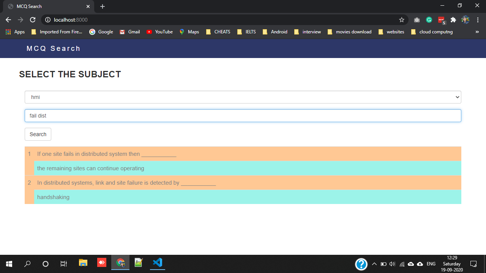

-------MCQ SEARCH------ 
This is an MCQ searching web application you can put words from the question you are looking for. 
No need of putting whole words which aren't consecutively placed. 
You can just put half words in any order. 
Eg. You searched for “proc dist” this will give all the questions having “proc” and “dist” in it. 
Output : In distributed system, each processor has its own ___________ 
         Answer: clock || local memory 
“||” is a separator for multiple answers to one question. 
 
--------------NOTE------------------- 
Just put your CSV files with the subject name (eg. Subject_name.csv) in the “search/files” folder. 
The first row of CSV should be “questions” and then “answers”. 
All the below rows should contain “your question” and then ”answer of the question”. 
If there are multiple answers just append in the same row. 
An example of a CSV file for HMI subject is provided in the “search/files” folder. 

